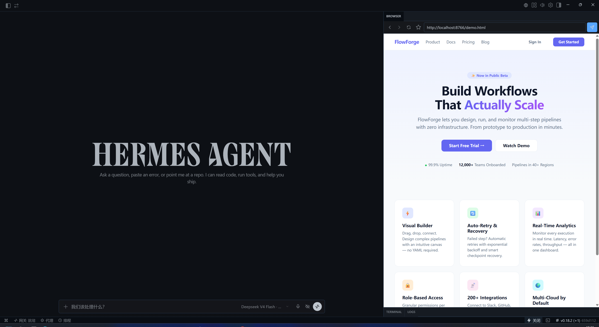

# Web Browser Plugin

A **Hermes Desktop Plugin** that embeds a webview browser pane into your workspace, so you can browse the web without switching windows. It also includes page annotation: mark elements on a page and add notes, then send them to your AI agent for auto-located edits.

[中文文档](README.zh.md)



## Features

- **Embedded browser** -- a real browser embedded in Hermes: multi-tab webview, address bar, navigation, bookmarks, and more
- **Page annotation** -- mark elements on a page, add notes with quick tags, and send them to your AI agent for auto-located edits (see [Annotator](#annotator))
- **Cache control** -- disable browser cache (non-persistent session) and clear cache from settings

## Annotator

A visual annotation → auto-edit workflow: mark any element on a page, send the annotation to your AI agent, and the agent locates the corresponding code and applies your change -- whether it is a bug fix, a style adjustment, a layout tweak, or a new feature. You only describe what to change; no need to say where or how.

The annotation feature is adapted from the Chrome extension [Annotator](https://github.com/AWhileLater/annotator), ported and deeply integrated into Hermes Desktop: per-tab independent annotations, one-click paste into the chat, and hardened injection security.

### How it works

1. Click the pen button in the toolbar to enter annotation mode
2. Click the element on the page that needs changing / adjusting / fixing -- a note popover appears
3. Type what should be done (or pick a quick tag), then save
4. Copy the prompt (or prompt + labeled screenshot) and send it to the agent / paste it into the chat
5. The agent locates the problem element and modifies the code according to your note

### Why it works: the agent knows exactly where

Every annotation carries precise locators -- **selector**, **domPath**, **text**, **position** -- plus the page URL and viewport. The agent uses these to find the exact element in the project's source and applies your instruction. You only describe what needs to change; the agent handles the "where".

### Quick tags

Quick tags auto-fill common modification instructions: **Bug**, **Style**, **Layout**, **Feature**, **Optimize**, **Interaction**. Click a tag to fill the note input, then tweak if needed.

### Copy & paste

- **Copy to input** -- one click copies it directly into the Hermes chat composer
- **Copy prompt** -- structured text (instruction + locators) ready to send to your agent
- **Copy prompt + screenshot** -- adds a labeled screenshot of the page; the prompt includes a screenshot hint

### Managing annotations

The annotation panel lists all annotations with edit / delete / clear. Each annotation stays highlighted on the page with a numbered bubble, and the overlay follows the element while you scroll.

### Settings

- **Enable screenshots** -- on by default; the screenshot provides auxiliary location cues (helps the agent confirm the target element visually). Turn it off if your model does not support vision (image analysis): no screenshot is taken and the prompt omits screenshot hints. Element location does not rely on vision -- the annotation's selector / domPath / text are enough for the agent to find it.
- **Quick annotation tags** -- when off, the tag row is hidden in the note popover

### Under the hood

The annotation engine is injected into each page via `executeJavaScript` and talks to the plugin over a `console-message` bridge (the `__ANNO__` prefix) with a polling fallback.

## Installation

### Prerequisites

- [Hermes Agent](https://hermes-agent.nousresearch.com) Desktop (the plugin does not work in CLI mode)

### Steps

**Option A -- Let Hermes install it (recommended)**

Copy the line below and paste it to your Hermes Agent:

```
Install the Hermes Desktop Plugin from https://github.com/AWhileLater/hermes-desktop-web-browser
```

That's it -- Hermes will clone the repository and set everything up automatically.

**Option B -- Manual install**

```bash
git clone https://github.com/AWhileLater/hermes-desktop-web-browser.git
cp -r hermes-desktop-web-browser ~/.hermes/desktop-plugins/hermes-desktop-web-browser
```

After either method, reload plugins by running **Reload desktop plugins** from the command palette (`Ctrl+K`).

## Usage

1. Click the globe icon in the Hermes Desktop status bar to open the browser panel
2. Type a URL in the address bar and press Enter
3. Use the toolbar buttons for back/forward/refresh; right-click a tab for close/reload/copy URL
4. Click the star to bookmark the current page
5. Use the pen button to annotate: click elements on the page, add a note (or pick a quick tag), then copy to clipboard or paste into the chat
6. Open settings (hamburger menu > Plugin Settings):
   - **Browser** section: disable browser cache for development (new tabs use a non-persistent session), clear cache
   - **Annotate** section: include screenshot when copying (off = no screenshot and no screenshot hint in the prompt), quick annotation tags

## Project Structure

```
hermes-desktop-web-browser/
├── plugin.js             # Main plugin file -- plain ESM JavaScript
├── script/
│   └── clear_cache.py    # Cache-clearing script (removes the plugin partition's disk cache)
├── README.md             # This file (English)
├── README.zh.md          # Chinese translation
├── LICENSE               # MIT License
└── screenshot.png        # Screenshot in action
```

## Development

The plugin is plain ESM JavaScript -- no build step. Save changes to `plugin.js` and it hot-reloads automatically.

### Conventions

- Plugin ID: `hermes-desktop-web-browser`
- Export signature: `export default { id, name, register(ctx) }`
- Dependencies limited to `@hermes/plugin-sdk` and `react`

## License

MIT
